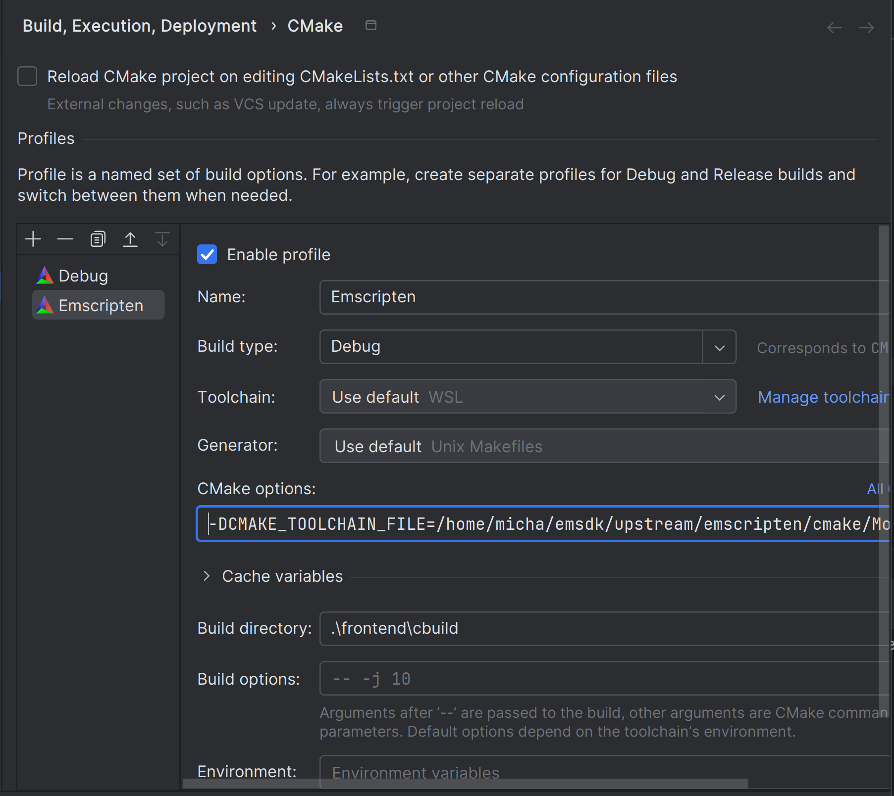

# Michael's Additions to the Documentation

There are a few quirks with our development pipeline we are going to be working with. Our workflow is going to be a frontend of HTML and typescript. The backend will be written in C++ but compiled into 

## React / Node.js

If you want to there is another `README.md` in `./frontend` that is auto generated when setting up the Vite React project.

React requires Node.js so you need to download and install [Node.js](https://nodejs.org/en).

After thats all done cd into `./frontend` then run these few commands. 

```bash
npm install
npm fund
npm run dev
o
```
This will install all of the dependencies. Run the development enviroment and open it in your browser.

### Development and Deployment

As of right now you have the development enviroment running and any changes you make to the React code base should be show in your browser as soon as your changes are saved.

This works wonderfully for development, but as of right now anyone that would want to use our program would have to go through everything above to use our code. There is this handy plugin that I've installed that changes how `npm run build` works. This will compile our code into a single `index.html` file that someone could run and open in their browser to use our code.

 These files that are generated in the `./frontend/dist` folder (generated after you execute `npm run build` for the first time) is what we will be submitting.

 As for how we are making our frontend I (Michael) am using bootstrap to make things look nice. You can read the docs [here](https://getbootstrap.com/docs/5.3/getting-started/introduction/). You are welcomed to use anything else if you choose, just don't try and use both bootstrap and something else at the sametime. That is a recipe for disaster.

 ## WebAssembly (wasm)

For the backend side of this project we will be compiling our C++ code into `.wasm` files. Our special little compiler for this is [Emscripten](https://emscripten.org/index.html). You will need to download this from [here](https://emscripten.org/docs/getting_started/downloads.html#sdk-download-and-install).

To compile with this you use `emcc` very similarly to how we used `gcc` for compiling. Read the [docs](https://emscripten.org/docs/compiling/Building-Projects.html) to understand it better.


## CMake Configuration
There is one weird change that you will need to make to your clion settings. In `File > Settings > Build, Execution, Deployment > CMake > Build directory` you will need to change this default to .\backend\cmake-build-debug if you want to have clion open in `./TraceAndPace` instead of `./backend`. This changed the build directory for the default `Debug` CMake profile.

You will also want to make another CMake profile that looks like the below. 
The CMake options is just has `-DCMAKE_TOOLCHAIN_FILE=<YourEmscriptenCloneLocation>/upstream/emscripten/cmake/Modules/Platform/Emscripten.cmake`. You must also change the build directory to `./frontend/cbuild`. The current CMake will work to compile everything into `.wasm` with the correct flags.

 I will also try to make some kind of class structure to use to generalize visualizations but I'm not sure how I will be going about this (Right now im thinking somekind of ABC). I'm also not sure how we will have the frontend and backend comunicate. Link sugested a `.json` file.
